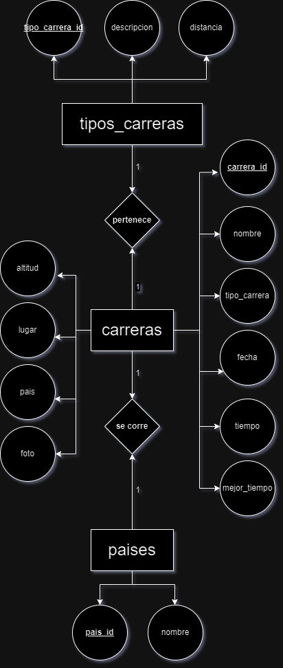
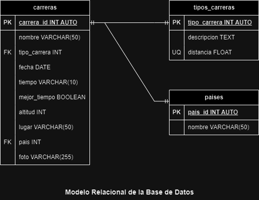

# Carreras

## Listado de Entidades

### carreras **(Entidad Datos)**

- carrera_id **(PK)**
- nombre
- tipo_carrera **(FK)**
- fecha
- tiempo
- mejor_tiempo
- altitud
- lugar
- pais **(FK)**
- foto

### tipos_carreras **(Entidad Catalogo)**

- tipo_carrera **(PK)**
- descripcion
- distancia **(UQ)**

### paises **(Entidad Catalago)**

- pais_id **(PK)**
- nombre

## Relaciones

1. Una **carrera** _pertenece_ a un **tipo de carreras** (_1 a 1_)
2. Una **carrera** se _corre_ en un **pais** (_1 a 1_)

## Diagramas

### Modelo Entidad - Relación

### Modelo Relacional de la Base de Datos

## Reglas de Negocio

### carreras

1. Crear el registro de una carrera
2. Leer el registro de una(s) carerra(s) dada una condicion en particular.
3. Leer todos los registros de la entidad carreras.
4. Actualizar los datos de una carrera dada una condicion en particular.
5. Eliminar los datos de una carrera dada una condicion en particular.

### tipos_carreras

1. Crear el registro de un tipo de carrera.
2. Leer el registro de un(s) tipo(s) de carrera(s) dada una condicion en particular.
3. Leer todos los registros de la entidad tipos carreras.
4. Actualizar los datos de un tipo de carrera dada una condicion en particular.
5. Eliminar los datos de un tipo de carrera dada una condicion en particular.
6. Todos los valores del atributo distancia, deberan estar expresados en _km_ y no se podran repetir.

### paises

1. Crear el registro de un pais.
2. Leer el registro de un(os) pais(es) dada una condicion en particular,
3. Leer todos los registros de la entidad paises.
4. Actualizar los datos de un pais dada una condicion en particular.
5. Eliminar los datos de un pais dada una condicion en particular.
