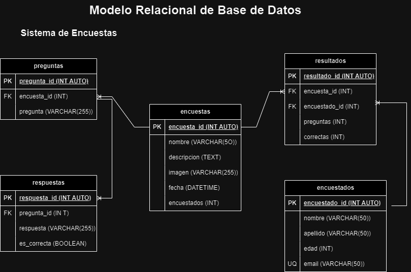

# Encuestas

## Listado de Entidades

### encuestas **(ED)**

- encuesta_id **(PK)**
- nombre
- descripcion
- imagen
- fecha
- encuestados

### preguntas **(ED)**

- pregunta_id **(PK)**
- encuesta_id **(FK)**
- pregunta

### respuestas **(ED)**

- respuesta_id **(PK)**
- pregunta_id **(FK)**
- respuesta
- es_correcta

### encuestados **(ED)**

- encuestado_id **(PK)**
- nombre
- apellidos
- edad
- email **(UQ)**

### resultado **(ED|EP)**

- resultado_id **(PK)**
- encuesta_id **(FK)**
- encuestado_id **(FK)**
- preguntas
- correctas

## Relaciones

1. Una **encuesta** tiene **preguntas** (_1 - M_).
2. Una **pregunta** tiene **respuestas** (_1 - M_).
3. Una **encuesta** tiene **resultados** (_1 - M_).
4. Un **encuestado** tiene **resultados** (_1 - M_).

## Diagramas

### Modelo Relacional de la BD

## Reglas de Negocio

### encuestas

1. Crear una encuesta.
2. Leer todas las encuestas.
3. Leer una encuesta en particular.
4. Actualizar una encuesta.
5. Eliminar una encuesta.
6. Aumentar en 1 el valor del atributo encuestado cada que un encuestado complete la encuesta.

### preguntas

1. Crear una pregunta.
2. Leer todas las preguntas.
3. Leer una pregunta en particular.
4. Actualizar una pregunta.
5. Eliminar una pregunta.

### respuestas

1. Crear una respuesta.
2. Leer todas las respuestas.
3. Leer una respuesta en particular.
4. Actualizar una respuesta.
5. Eliminar una respuesta.

### encuestados

1. Crear una encuestados.
2. Leer todos los encuestados.
3. Leer un encuestado en particular.
4. Actualizar un encuestado.
5. Eliminar un encuestado.
6. Antes de crear un encuestado en la entidad, verificar mediante su email que no exista.

### resultados

1. Crear un resultado.
2. Leer todas los resultados.
3. Leer un resultado en particular.
4. Actualizar un resultado.
5. Eliminar un resultado.
6. Sacar el porcentaje de asertividad que tuvo el encuestado al contestar la encuesta.
